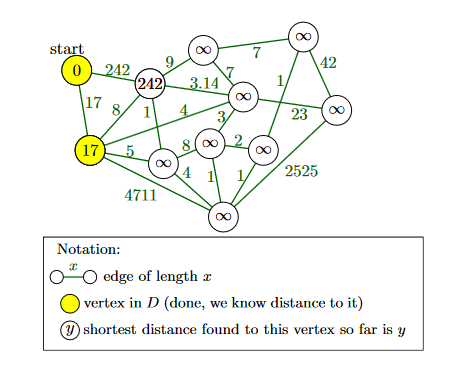

**Greedy algorithms** are algorithms that build a solution step by step by always choosing the currently best option. (Without worrying about potentially bad future consequences of that option.)
- Two main design choices
    - What do we mean by “step by step”? In what order do we build up a solution?
    - What do we mean by “currently best”? What measure do we try to optimize locally?
- Typical characteristics of a greedy algorithm
    - Often very fast and simple (but not always).
    - Often difficult to prove correct or actually not correct at all

**Correctness analysis for greedy algos**
- Common strategy for analyzing greedy algorithms: prove that the algorithm always “stays ahead” of the optimal solution
- another stratgy is to "start with an optimal solution, and show that it can be transformed into the solution found by the algorithm without becoming worse"

**Lemma**

**Dijkstra's shortest path**
    
