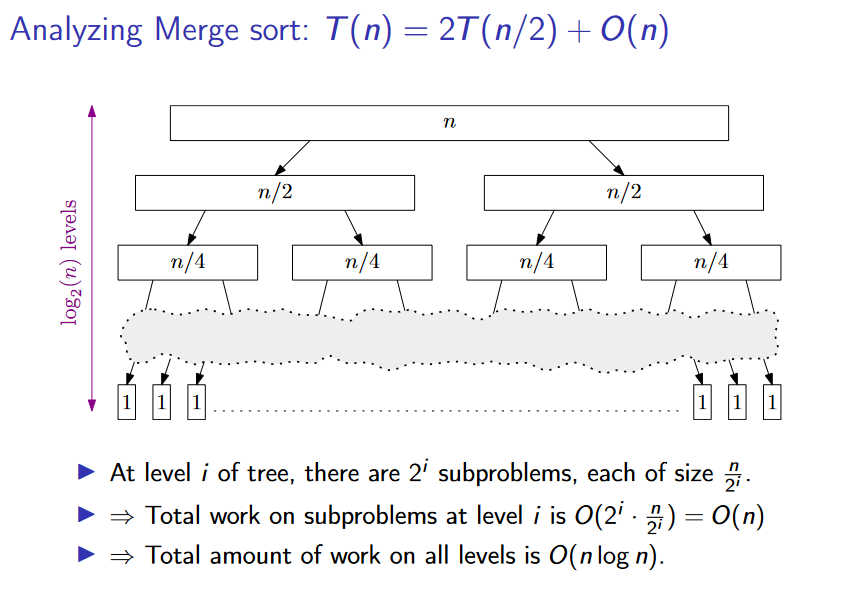
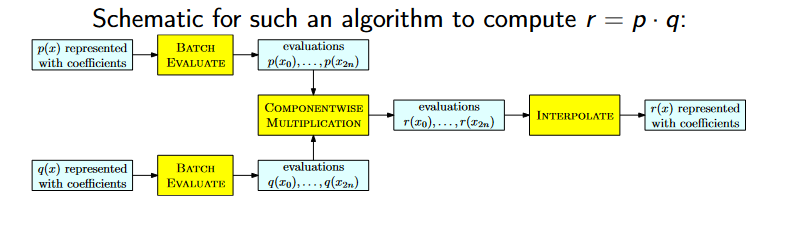
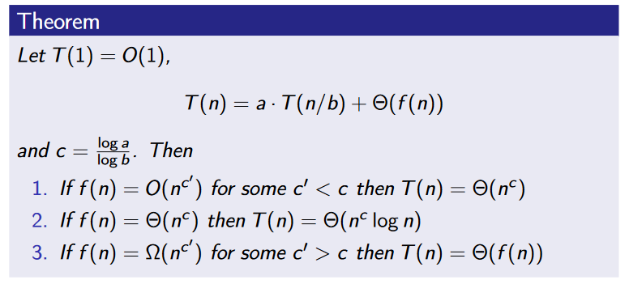

**Divide and conquer**
- Algorithms that split the input into significantly smaller parts, recursively solves each part, and then combines the subresults (somehow).
- Because of recursive nature, analyzing time complexity of D&C algorithms is about analyzing recurrences.

**Polynomial multiplication**
- We want to compute $p*q=(p_hx^{n/2}+p_l)*(q_hx^{n/2}+q_l)=p_hq_hx^n+(p_hq_l+p_lq_h)x^{n/2}+p_lq_l$
- Clever trick: $p_hq_l+p_lq_h=(p_l+p_h)(q_l+q_h)-p_lq_l-p_hq_h=p'q'-p_lq_l-p_hq_h$
- So we can write: $p*q=p_hq_hx^n               +(p'q'-p_lq_l-p_hq_h)x^{n/2}+p_lq_l$
- Only involves *three* different multiplactions of degree $n/2$ polys.

**Integer multiplication (Karatsuba's algorithm)**
- same approach as for poly
- write $a=a_h10^{n/2}+a_l$ and $b=b_h*10^{n/2}+b_l$
- $a'=a_h+a_l$ and $b=b_h+b_l$
- Then $a*b=a_hb_h*10^n+(a'b'-a_hb_h-a_lb_l)10^{n/2}+a_lb_l$
- compute the three products recursively
- add up results in $O(n)$ time

**Cost of arithmetic**
- *Unit cost model*: assume all numbers fit in machine registers so that basic arithmetic operations take constant time
- *Bit cost model*: account for size of numbers and the time it takes to manipulate them

**Batch evaluations**

- Fast Fourier Transform
- O(n*log n) for mul

**Master Theorem**

- "We only need to look at (and compare) the work for the top and bottom levels of recursion"