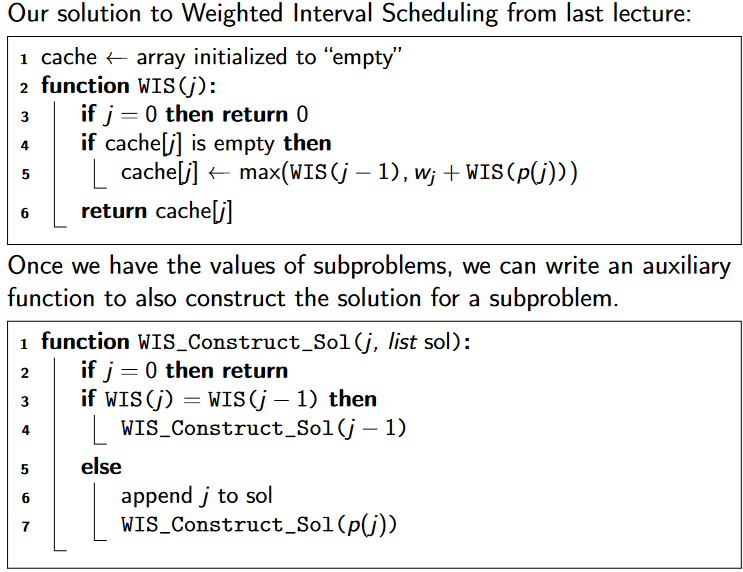
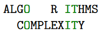
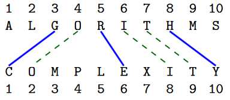
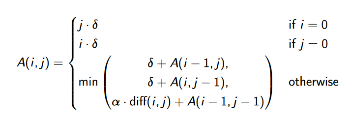

Recap examples from last lecture
- Fibonacci numbers
    - Here the definition of the problem came with a recurrence and subproblems.
- Weighted Interval Scheduling 
    - We sorted intervals by right endpoint and defined subproblems of the form “What is optimal solution on first j intervals?”
- Knapsack
    - Subproblems of the form “What is optimal solution on first j objects if capacity is C′?” (two parameters, 0 ≤ j ≤ n and 0 ≤ C′ ≤ C)

**Constructing solutions**

**Aligning strings**
- We consider a more general variant, with two parameters:
    - having a gap (lining up a character with a blank space) costs ‹
    - lining up two different characters costs

- Above alignment costs $8\delta+3\alpha$
- Another way of visualizing alignments graphically is via matchings

- in example above we have $M={(3,1)(4, 2), (5, 6), (6, 8), (7, 9), (8, 10)}$
- In order for matching to be valid, it cannot have any crossing edges.
- M is an optimal matching. Three cases:
    1. $(m,n)\in M:$
        - if $x[m]\neq y[n]$ we pay $\alpha$ for mismatch
        - rest of M is optimal alignment of $x[1...m-1]$ and $y[1...n-1]$
    2. $x[m]$ is not aligned
        - we pay $\delta$ is not aligning $x[m]$
        - M is an optimal alignment of $x[1...m-1]$ and $y[1...n]$
    3. $y[n]$ is not aligned
        - we pay $\delta$ is not aligning $y[n]$
        - M is an optimal alignment of $x[1...m]$ and $y[1...n-1]$
- 
- Here we used $diff(i,j)$ for the 0/1-indicator of wether $x[i]\neq y[j]$
- Final answer $A(m,n)$
- Turning this recurrence into a dynamic programming algorithm which saves all the subresults, we get an algorithm with time complexity $O(m · n)$.

**Matrix chain multiplication**
