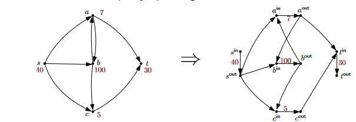
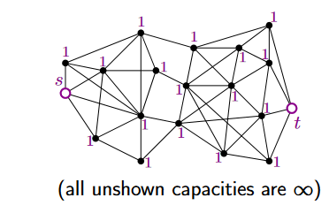
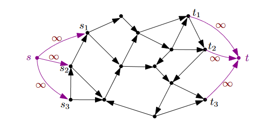
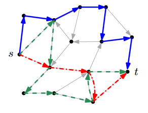
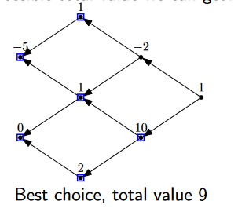

Mastery test
- informal low grade
- formal eg. induction higher grade

# flows

Modelling vertex capacitiess
- Can handle vertext cap. by splitting each vertex x into $x^{in}$ and $x^{out}$
- 
- Max-flow from $s^{in}$ to $t^{out}$ in new graph (with only edge capacities) equals max-flow from s to t in original graph

**s-t-vertex cut** in a graph is a set M of vertices such that if we remove them, no paths from s to t remain
- Just like edge cuts, a natural problem is to look for a minimum s-t-vertex cut.
- We can find minimum s-t-vertex cuts by assigning
- 
    - vertex capacities of 1 (except at s and t)
    - edge capacities of ∞
- A maximum s-t-flow is now equivalent to a minimum s-t-vertex cut in the input graph

**many sources/sinks**
- add "super source" s, and infinite-capacity edges from s to all the sources in network
- add "super sink" t in the same way
- 

## bipartite matching
A **matching** in a graph is a set M of edges such that no vertex appears in more than one edge of M

**Maximum Bipartite Matching**
- Input: A bipartite graph G
- Output: A Matching M in G of maximum possible size

## Edge-disjoint paths
Given a directed graph with source and sink, what is maximum number of edge-disjoint paths from s to t? 
- (edge-disjoint = no edge used by more than one path)
- 
- Variation: if we are instead interested in vertex-disjoint paths, we assign vertex capacities of 1

## The closure problem
- We have a set of n projects 
    (tasks we can do / courses we can take / etc)
- Each project has a (possibly negative) value $v_i$
    (profit we make from it / how interested we are in it / etc)
- Dependencies between the projects – if we choose to do a project we must also choose all projects it depends on.
- What is max possible total value we can get?
- 

