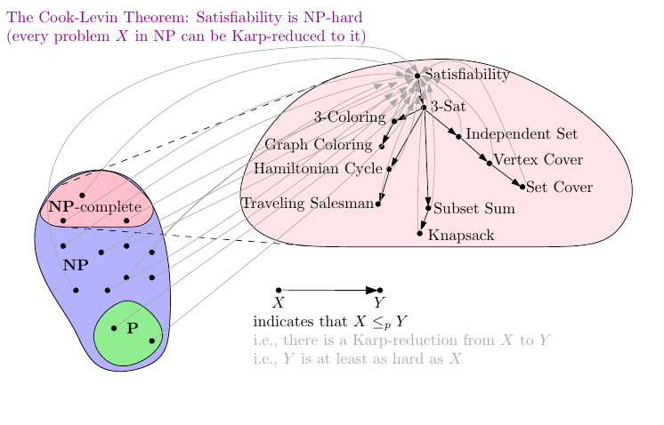
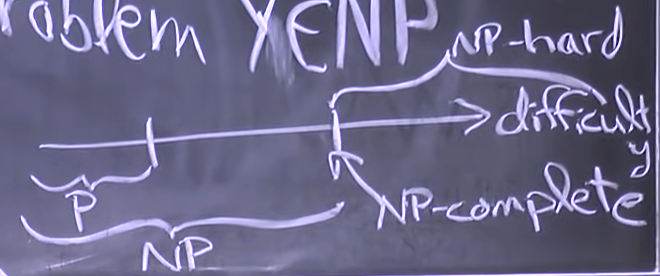
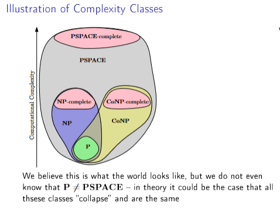
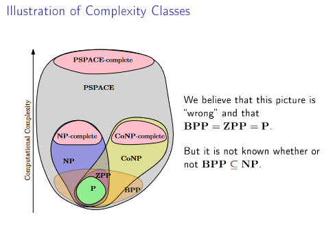

$P=\{$ problems solvable in polynomial time $\}$

- polynomial -> $n^{O(1)}$ (for problems of size $n$)

$NP=\{$ decision problems solvable in nondeterministic polynomial time $\}$

- decision prblmes -> answer is _yes_ or _no_
- in a non-deterministic model, instead of computing, guess 1 out of polynomially many options in constant time $O(1)$
- if any guess would lead to _yes_ answer then we get such a guess

**NP-hard**

- $X$ is NP-hard if every problem $y\in NP$ can be Karp-reduced to $X$
- As a consequence, finding a polynomial time algorithm to solve a single NP-hard problem would give polynomial time algorithms for all the problems in the complexity class NP. As it is suspected that P≠NP, it is unlikely that such an algorithm exists
- "at least as hard as every problem in NP"

**NP-complete**

- $X$ is NP-complete if $X\in$ NP and $X$ is NP-hard
- Example: **Boolean satisfiability**

**Complexities difficulty:**

- NOTE: we don't know whether $P=NP$. (probably not according MIT guy)
- assuming $P\neq NP$, any NP-hard problem is not in P.

**Reduction** from problem $A \to B$ = poly-time algorithm converting $A$ inputs $\to$ _equivalent_ $B$ inputs

- _Equivalent_ means they have the same yes/no answer
- If $B\in P$ then $A\in P$
- If $B\in NP$ then $A\in NP$

**How to prove $X$ is NP-complete:**

1. Prove that $X\in NP$
   - nondeterministic algorithm OR certificate + verifier
   - The term **certicate** does not have a formal meaning, but it is some information that we use for proving that some instance of a problem is a yes instance.
2. prove that $X\in NP$-hard
   - Reduce from known NP-complete problem $Y$ to $X$

- **CoNP** consists of all problems where "no" answer can be efficiently verified
  - we say $x\in CoNP$ if the complement $\overline{X}\in NP$
  - **CoNP-hard** (as hard as all problems in CoNP)
  - **CoNP-complete** (the hardest problems in CoNP)
  - $X$ is CoNP-hard (or CoNO-complete) $\Leftrightarrow$ $\overline X$ is NP-Hard (or NP-complete)
  - This means that for every NP-complete problem there is acorresponding CoNP-complete problem (and vice versa)
- **PSPACE** consists of all problems that can be solved by an algorithm using at most a polynomial amount of space.
  - $P\subseteq PSPACE$
  - $NP\subseteq PSPACE$
  - $PSPACE$-hard if $X \leq _p Y$ for every $X\in PSPACE$
  - $PSPACE$-complete if $PSPACE$-hard and additionally $Y\in PSPACE$
- **BPP** (Bounded-error Probabilistic Polynomial-time) consists of all decision problems for which there is a polynomial-time randomized algorithms that is correct with probability at least 2/3 on all instances.
- **ZPP** (Zero-error Probabilistic Polynomial Time) consists of all decision problems for which there is a Las Vegas algorithm running in expected polynomial time.
